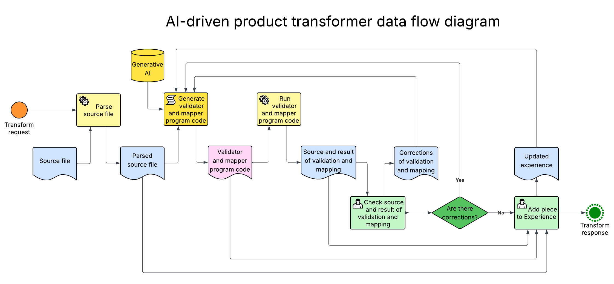

## AI product transformer small PoC

### Goal

The goal of the PoC is to demonstrate, how a two-step AI product feed transformer from a customer product feed to a given unified format feed could be implemented:
1. First step - creating and saving of the converter.
2. Second step - loading and running of the converter.

### Concept

As a first step, I'm starting from implementation of a prototype as a running locally web-application, converting a local JSON-file to another local JSON-file.
The following are considered important:
1. The results of transformation should be reproducible.
2. The AI-model should be trainable - it should learn from the previous experience.

### Use-case

1. Transform gets a source-file.
2. Transform uses AI-prompt and Experience to write a program code of the validator and a program code of the mapper for the given source-file.
3. Transform runs the new validator and the new mapper and sends the source and the result to a human supporter.
4. The supporter checks the source and the result.
5. If quality is not enough:
   1) Supporter corrects the result and returns corrections to the Transform.
   2) Transform considers corrections, rewrites the validator and the mapper and continues to step 3.
6. Else supporter finishes the Transform and adds the piece to the Experience.

The piece of Experience is:
1. source file;
2. correct validator program code;
3. correct validation log;
4. correct mapper program code;
5. correct result file.

I would suggest to commit both AI-prompt and Experience to the git-repo. This approach would allow to have multiple versions of AI-prompt and Knowledge in git-branches and compare them when needed.

### Data flow diagram



### Plan

1. Create result-format (text document).
2. Create Transform program code with interface:

Inputs:
- source-file;
- possible corrections from pervious iteration.

Outputs:
- validator code, results of running validator;
- mapper code, results of running mapper.
3. Create an AI-prompt to write a program code of the validator and a program code of the mapper from a source-file to the result-format.
4. Find an example of source-format, test and train the Transformer, committing changes to the repo.

### Demo run

1. Clone the repository:
```shell
git clone https://github.com/a-bobkov/ai-product-transformer.git && cd ai-product-transformer
```
2. Copy the [envExample.js](envExample.js) into `envDev.js` and set your value for `OPENAI_API_KEY`:
```shell
cp envExample.js envDev.js
```
3. Run in terminal:
```shell
time node learn.js
```
4. See the log:
```shell
Learning to transform customer feed from source id: example_1

Learning by example customer feed:  [
  {
    ID: 11,
    SKU: '1234567-00001',
    BESCHREIBUNG: 'Stuhl Bellevue',
    PREIS: '39,80 EUR',
    FARBE: 'Schwarz',
    GROSSE: '60 cm',
    BILD_URL: 'https://dj2hx6apm0rq.cloudfront.net/images/C04E90C7-2044-41EA-A34E-F5E79D8ABB0F/?S=865&F=WEBP?S=865&F=WEBP',
    KATEGORIE: 'Stühle'
  }
]

Converter is created with length 6638 chars and saved into file: ./converters/example_1/converter.js
node learn.js  0,29s user 0,09s system 0% cpu 2:21,70 total
```
5. See the result - saved converter is a valid JavaScript function:
```shell
less ./converters/example_1/converter.js
```
6. Run in terminal:
```shell
node transform.js
```
7. See the log:
```shell
Transforming customer feed from source id: example_1

Source customer feed:  [
  {
    ID: 11,
    SKU: '1234567-00001',
    BESCHREIBUNG: 'Stuhl Bellevue',
    PREIS: '39,80 EUR',
    FARBE: 'Schwarz',
    GROSSE: '60 cm',
    BILD_URL: 'https://dj2hx6apm0rq.cloudfront.net/images/C04E90C7-2044-41EA-A34E-F5E79D8ABB0F/?S=865&F=WEBP?S=865&F=WEBP',
    KATEGORIE: 'Stühle'
  }
]

Result unified feed:  [
  {
    id: '11',
    sku: '1234567-00001',
    name: 'Stuhl Bellevue',
    price: 3980,
    priceUnit: 'EUR cent',
    category: 'Stühle',
    color: 'Schwarz',
    imageUrl: 'https://dj2hx6apm0rq.cloudfront.net/images/C04E90C7-2044-41EA-A34E-F5E79D8ABB0F/?S=865&F=WEBP?S=865&F=WEBP',
    size: '60 cm'
  }
]
```
8. See the result - saved transformed feed meets the requirements of the scheme `unifiedProductFormat.json`:
```shell
cat feeds_out/example_1/unifiedProductFeed.json
```
